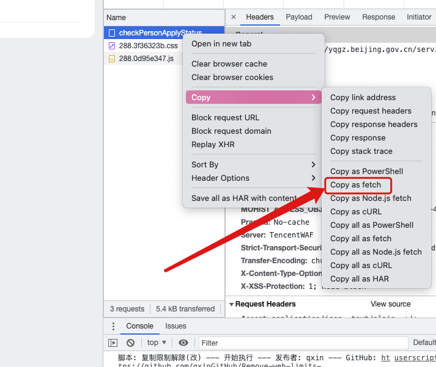

# fast_return_to_Beijing
### 项目已弃用 纪念我们黑暗的三年
快速回京解除弹窗辅助器
### 快速通知状态 最快4小时解除弹窗 
* 首先在北京12345中反馈弹窗纠错
* 提交完成后 打卡浏览器 进入 https://yqgz.beijing.gov.cn/wssryfw
* 进入浏览器开发工具 （F12）
* 填写身份证号 点击立即登陆 
* 在请求中 按照图中选择 

* 复制到内容中 body 中的内容填入 gotu_beijing.py 第五行
* 其中第33行需要iPhone用户安装bark 添加用户key 其他平台可替换其他推送方式 例如短信等 
* pip3 install requests  （可能需要安装）
* python3 gotu_beijing.py 
# 等待通知即可 
### 注意 在输出审核中时候 给社区打电话 即可加速审核 
